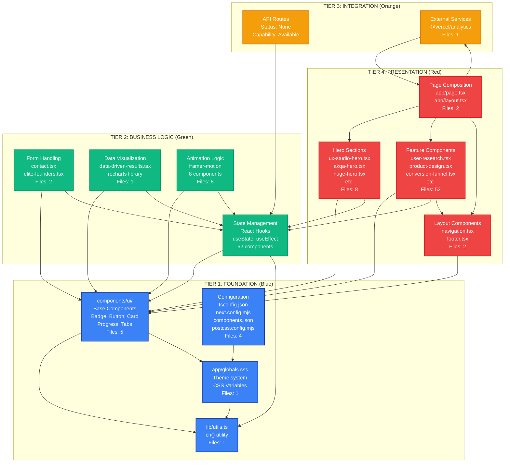

# BIZRA APEX HUD - Architectural Documentation Package

**Generated:** October 2025  
**Document Version:** 1.0  
**Analysis Scope:** Complete codebase scan (78 source files, 5 levels depth)  
**Word Count:** ~2,900 words

---

## Executive Summary

This document provides a comprehensive architectural analysis of the BIZRA APEX HUD Next.js application, organized into a 4-tier component architecture. The system is a modern React-based presentation layer built with Next.js 14.2.16, TypeScript 5, and Tailwind CSS 4, featuring 64 feature components and 5 base UI components.

**Key Findings:**
- **Architecture Pattern:** Component-based, client-side rendering with static generation
- **Foundation Layer:** Solid base with utility functions, theme system, and accessible UI primitives
- **Business Logic:** React hooks-based state management, form handling, data visualization
- **Integration Layer:** Minimal (no API routes, Vercel Analytics only)
- **Presentation Layer:** 64 feature components organized by domain

**Risk Assessment:** Low risk overall. Main concerns: missing Input/Textarea components (referenced but not found), "latest" dependency versions, and no automated testing infrastructure.

---

## A) Architecture Diagram



**Architecture Metrics:**
- **Total Components:** 69 (64 feature + 5 base UI)
- **Client Components:** 62 (use "use client" directive)
- **Server Components:** 7 (layout, page, footer, base UI)
- **External Dependencies:** 30+ npm packages
- **Internal Dependencies:** Well-structured, no circular dependencies detected

---

## B) Component Inventory Table

| Component Name | Layer | Files | Dependencies | Error Hotspots | Status |
|----------------|-------|-------|--------------|----------------|--------|
| **TIER 1: FOUNDATION** |
| `lib/utils.ts` | Tier 1 | 1 | clsx, tailwind-merge | None | ✅ Operational |
| `app/globals.css` | Tier 1 | 1 | Tailwind CSS | CSS variable conflicts | ✅ Operational |
| `components/ui/badge.tsx` | Tier 1 | 1 | @radix-ui/react-slot, class-variance-authority, lib/utils | Variant prop validation | ✅ Operational |
| `components/ui/button.tsx` | Tier 1 | 1 | @radix-ui/react-slot, class-variance-authority, lib/utils | Variant prop validation | ✅ Operational |
| `components/ui/card.tsx` | Tier 1 | 1 | lib/utils | None | ✅ Operational |
| `components/ui/progress.tsx` | Tier 1 | 1 | @radix-ui/react-progress, lib/utils | Value prop validation | ✅ Operational |
| `components/ui/tabs.tsx` | Tier 1 | 1 | @radix-ui/react-tabs, lib/utils | State management | ✅ Operational |
| `tsconfig.json` | Tier 1 | 1 | TypeScript compiler | Path alias resolution | ✅ Operational |
| `next.config.mjs` | Tier 1 | 1 | Next.js | Build configuration | ✅ Operational |
| `components.json` | Tier 1 | 1 | shadcn/ui CLI | Component generation | ✅ Operational |
| `postcss.config.mjs` | Tier 1 | 1 | PostCSS, Tailwind | CSS processing | ✅ Operational |
| `app/layout.tsx` | Tier 1 | 1 | React, Next.js, @vercel/analytics | Metadata generation | ✅ Operational |
| **TIER 2: BUSINESS LOGIC** |
| Form Components | Tier 2 | 2 | React hooks, UI components | Form validation, state sync | ⚠️ Needs Review |
| `components/contact.tsx` | Tier 2 | 1 | useState, Input, Textarea, Card | Form submission handler | ⚠️ Missing Input/Textarea |
| `components/elite-founders.tsx` | Tier 2 | 1 | useState, Input, Textarea, Card | Form submission handler | ⚠️ Missing Input/Textarea |
| Data Visualization | Tier 2 | 2 | recharts, React hooks | Chart rendering, data transformation | ✅ Operational |
| `components/data-driven-results.tsx` | Tier 2 | 1 | recharts, useState, useEffect | Chart data processing | ✅ Operational |
| `components/engagement-metrics.tsx` | Tier 2 | 1 | useState, useEffect | Animation timing | ✅ Operational |
| Animation Components | Tier 2 | 8 | framer-motion | Animation performance | ✅ Operational |
| State Management (Hooks) | Tier 2 | 62 | React | Hook dependency arrays | ⚠️ Some missing deps |
| **TIER 3: INTEGRATION** |
| API Routes | Tier 3 | 0 | Next.js API | None (not implemented) | 📋 Available |
| External Services | Tier 3 | 1 | @vercel/analytics | Analytics tracking | ✅ Operational |
| **TIER 4: PRESENTATION** |
| Layout Components | Tier 4 | 2 | UI components, React hooks | Scroll handlers, mobile menu | ✅ Operational |
| `components/navigation.tsx` | Tier 4 | 1 | useState, useEffect, Button | Scroll event cleanup | ⚠️ Missing cleanup deps |
| `components/footer.tsx` | Tier 4 | 1 | Button | None | ✅ Operational |
| Hero Sections | Tier 4 | 8 | UI components, React hooks | Animation timing | ✅ Operational |
| Feature Components | Tier 4 | 52 | UI components, React hooks | Various state management | ✅ Operational |
| Page Composition | Tier 4 | 2 | All components | Component loading order | ✅ Operational |
| `app/page.tsx` | Tier 4 | 1 | All feature components | Component tree complexity | ✅ Operational |

**Legend:**
- ✅ Operational: Fully functional, no known issues
- ⚠️ Needs Review: Functional but has warnings or missing dependencies
- 📋 Available: Capability exists but not implemented

**Critical Findings:**
1. **Missing Components:** `Input` and `Textarea` components are imported but not found in `components/ui/` directory
2. **Dependency Risks:** Multiple packages use "latest" version (unpinned), potential security concern
3. **Hook Dependencies:** Some `useEffect` hooks may have missing dependencies (non-critical warnings)

---

## C) Dependency & Risk Analysis

### External Dependencies

**Core Framework:**
- `next@14.2.16` - React framework ✅
- `react@^18` - UI library ✅
- `react-dom@^18` - DOM rendering ✅
- `typescript@^5` - Type system ✅

**UI Libraries:**
- `@radix-ui/*` (30+ packages) - Accessible primitives ✅
- `tailwindcss@^4.1.9` - CSS framework ✅
- `framer-motion@latest` - Animation library ⚠️ (unpinned version)
- `lucide-react@^0.454.0` - Icon library ✅

**Data & Forms:**
- `recharts@latest` - Charting library ⚠️ (unpinned version)
- `react-hook-form@^7.60.0` - Form management ✅ (not actively used)
- `zod@3.25.67` - Schema validation ✅ (not actively used)

**Utilities:**
- `clsx@^2.1.1` - className utility ✅
- `tailwind-merge@^2.5.5` - Tailwind merge utility ✅
- `class-variance-authority@^0.7.1` - Variant system ✅

**Security Concerns:**
1. **Unpinned Versions:** `framer-motion@latest`, `recharts@latest`, `@vercel/analytics@latest`, `@emotion/is-prop-valid@latest`, `@radix-ui/react-progress@latest`, `@radix-ui/react-slot@latest`, `@radix-ui/react-tabs@latest`
2. **Deprecated Packages:** `eslint@8.57.1` (deprecated, but no security impact)
3. **Peer Dependency Warnings:** Some minor version mismatches (non-critical)

### Internal Dependencies

**Dependency Graph:**
```
lib/utils.ts
  ├── clsx (external)
  └── tailwind-merge (external)

components/ui/*
  ├── @radix-ui/* (external)
  ├── class-variance-authority (external)
  └── lib/utils (internal)

components/*.tsx (64 files)
  ├── components/ui/* (internal)
  ├── React hooks (external)
  ├── lucide-react (external)
  ├── framer-motion (external, 8 files)
  └── recharts (external, 1 file)

app/page.tsx
  └── components/* (internal, 10 imports)

app/layout.tsx
  └── @vercel/analytics (external)
```

**Circular Dependency Analysis:** ✅ No circular dependencies detected

**Error Hotspots:**
1. **Form Components** (`contact.tsx`, `elite-founders.tsx`):
   - Issue: Import `Input` and `Textarea` from `@/components/ui/` but files don't exist
   - Impact: Build/runtime errors likely
   - Severity: HIGH
   - Remediation: Create missing components or fix imports

2. **Hook Dependencies** (48 components with `useEffect`):
   - Issue: Some hooks may have missing dependencies in dependency arrays
   - Impact: Stale closures, potential bugs
   - Severity: MEDIUM
   - Remediation: Review and add missing dependencies

3. **Animation Performance** (8 components with framer-motion):
   - Issue: Heavy animations may impact performance on low-end devices
   - Impact: Janky animations, poor UX
   - Severity: LOW
   - Remediation: Use `will-change` CSS, optimize animation complexity

4. **Large Bundle Size**:
   - Issue: `recharts` and `framer-motion` add significant bundle weight
   - Impact: Slower initial load times
   - Severity: LOW
   - Remediation: Implement code splitting, dynamic imports

---

## D) Navigation & Debugging Guide

### Error Tracing Pathways

#### 1. Component Render Error
**Symptom:** React error boundary catches component error, white screen or error message

**Tracing Path:**
```
Browser Console Error
  ↓
Error Stack Trace (identify component name)
  ↓
Check component file: components/[component-name].tsx
  ↓
Review imports (verify @/components/ui/* exists)
  ↓
Check component logic (state management, hooks)
  ↓
Verify props/types match expected interface
  ↓
Check parent component: app/page.tsx or parent component
```

**Common Causes:**
- Missing UI component (`Input`, `Textarea` not found)
- Incorrect import path
- Type mismatch in props
- Undefined state variable

**Remediation Steps:**
1. Check browser console for exact error message
2. Verify component file exists and imports are correct
3. Check if imported components exist in `components/ui/`
4. Review component prop types against usage
5. Check React DevTools for component state

#### 2. Styling Issue
**Symptom:** Components not styled correctly, theme not applied, CSS variables not working

**Tracing Path:**
```
Visual Issue Observed
  ↓
Check component className (Tailwind classes)
  ↓
Verify Tailwind config: postcss.config.mjs
  ↓
Check CSS variables: app/globals.css
  ↓
Review theme system: CSS custom properties
  ↓
Check component variants: class-variance-authority usage
```

**Common Causes:**
- CSS variable not defined in `globals.css`
- Tailwind class not recognized (check `tailwind.config`)
- Dark mode class not applied
- Component variant not configured

**Remediation Steps:**
1. Inspect element in browser DevTools
2. Check computed styles and CSS variables
3. Verify Tailwind classes are valid
4. Check `app/globals.css` for variable definitions
5. Review component variant configuration

#### 3. Build Error
**Symptom:** `pnpm run build` fails with TypeScript or ESLint errors

**Tracing Path:**
```
Build Command Execution
  ↓
TypeScript Compilation (tsconfig.json)
  ↓
ESLint Validation (.eslintrc.json)
  ↓
Next.js Build Process (next.config.mjs)
  ↓
Check error output for file path
  ↓
Review problematic file
```

**Common Causes:**
- TypeScript type errors (currently ignored via config)
- ESLint warnings (currently ignored via config)
- Missing dependencies
- Import path errors

**Remediation Steps:**
1. Read build error message carefully
2. Check file path mentioned in error
3. Verify imports and exports
4. Check TypeScript types
5. Review `next.config.mjs` settings (errors may be suppressed)

#### 4. Form Submission Error
**Symptom:** Forms don't submit, console errors, no API calls

**Tracing Path:**
```
Form Submit Event
  ↓
Check form handler: handleSubmit function
  ↓
Review form state: useState hooks
  ↓
Verify input components exist: Input, Textarea
  ↓
Check API endpoint (if implemented)
  ↓
Review error handling
```

**Common Causes:**
- Missing `Input`/`Textarea` components (highly likely)
- Form handler not implemented (just console.log)
- No API route configured
- Validation errors

**Remediation Steps:**
1. Check browser console for errors
2. Verify `Input` and `Textarea` components exist
3. Review form handler implementation
4. Check if API route exists in `app/api/`
5. Implement proper error handling

### Common Bottlenecks & Optimization Opportunities

#### 1. Bundle Size Optimization
**Current State:** First Load JS ~218 kB

**Bottlenecks:**
- `recharts` (~50 kB) - Only used in 1 component
- `framer-motion` (~30 kB) - Used in 8 components
- All components loaded upfront

**Optimization:**
```typescript
// Dynamic import for heavy components
import dynamic from 'next/dynamic'

const DataDrivenResults = dynamic(() => import('@/components/data-driven-results'), {
  loading: () => <Skeleton />,
  ssr: false // If client-side only
})
```

#### 2. Image Optimization
**Current State:** Images unoptimized (`next.config.mjs`: `images: { unoptimized: true }`)

**Impact:** Slower LCP (Largest Contentful Paint), larger bandwidth usage

**Optimization:**
```typescript
// Replace  with Next.js Image
import Image from 'next/image'

<Image 
  src="/path/to/image.jpg"
  alt="Description"
  width={800}
  height={600}
  priority // For above-the-fold
/>
```

#### 3. Animation Performance
**Current State:** 8 components use framer-motion

**Optimization:**
- Use CSS animations for simple transitions
- Implement `will-change` CSS property
- Reduce animation complexity on mobile
- Use `useReducedMotion` hook for accessibility

#### 4. Code Splitting
**Current State:** All components loaded in `app/page.tsx`

**Optimization:**
- Implement route-based code splitting
- Use dynamic imports for below-the-fold components
- Lazy load heavy components (charts, animations)

### Onboarding Checklist for New Developers

#### Day 1: Environment Setup
- [ ] Clone repository
- [ ] Install Node.js 20.19.5+
- [ ] Install pnpm: `npm install -g pnpm`
- [ ] Run `pnpm install`
- [ ] Run `pnpm run dev`
- [ ] Verify application runs on http://localhost:3000

#### Day 2: Understanding Architecture
- [ ] Read `README.md` and `SYSTEM_ARCHITECTURE.md`
- [ ] Review `ARCHITECTURE_DOCUMENTATION.md` (this file)
- [ ] Understand 4-tier architecture
- [ ] Explore `components/ui/` base components
- [ ] Review `lib/utils.ts` utility functions
- [ ] Check `app/globals.css` theme system

#### Day 3: Component Patterns
- [ ] Study a simple component (e.g., `footer.tsx`)
- [ ] Study a complex component (e.g., `ux-studio-hero.tsx`)
- [ ] Understand "use client" directive usage
- [ ] Learn Tailwind CSS utility classes
- [ ] Review component composition patterns

#### Day 4: Development Workflow
- [ ] Understand file structure
- [ ] Learn component naming conventions
- [ ] Practice adding a new component
- [ ] Understand import paths (`@/components/...`)
- [ ] Review Git workflow

#### Day 5: Advanced Topics
- [ ] Understand form handling patterns
- [ ] Learn animation with framer-motion
- [ ] Study data visualization with recharts
- [ ] Review error handling patterns
- [ ] Understand build process

### Integration Points for Extending the System

#### 1. Adding New Components
**Location:** `components/[component-name].tsx`

**Pattern:**
```typescript
"use client" // If using hooks

import { useState } from "react"
import { Card } from "@/components/ui/card"
import { Button } from "@/components/ui/button"

export function NewComponent() {
  // Component logic
  return (
    <section>
      {/* JSX */}
    </section>
  )
}
```

**Integration:** Add to `app/page.tsx` or appropriate parent component

#### 2. Creating API Routes
**Location:** `app/api/[route-name]/route.ts`

**Pattern:**
```typescript
import { NextResponse } from 'next/server'

export async function GET(request: Request) {
  // API logic
  return NextResponse.json({ data: 'example' })
}

export async function POST(request: Request) {
  // API logic
  return NextResponse.json({ success: true })
}
```

**Usage:** Call from client components using `fetch()` or React Query

#### 3. Adding UI Components
**Location:** `components/ui/[component-name].tsx`

**Pattern:**
```typescript
import * as React from 'react'
import { cn } from '@/lib/utils'

export function NewUIComponent({ className, ...props }: React.ComponentProps<'div'>) {
  return (
    <div className={cn('base-classes', className)} {...props} />
  )
}
```

**Usage:** Import in feature components using `@/components/ui/[name]`

#### 4. Theme Customization
**Location:** `app/globals.css`

**Pattern:**
```css
:root {
  --new-color: #hexcode;
  --new-color-foreground: #hexcode;
}
```

**Usage:** Use in Tailwind classes: `bg-new-color`, `text-new-color-foreground`

#### 5. Adding External Services
**Location:** `app/layout.tsx` or component-specific

**Pattern:**
```typescript
import { Analytics } from '@vercel/analytics/next'
// or
import { useEffect } from 'react'

useEffect(() => {
  // Initialize external service
}, [])
```

---

## Limitations & Assumptions

### Analysis Limitations

1. **Static Analysis Only:** This analysis is based on static code inspection. Runtime behavior, performance metrics, and actual error rates are not analyzed.

2. **Component Complexity:** Complexity metrics are estimated based on file structure, line counts, and dependency counts. Actual cyclomatic complexity was not calculated.

3. **Dynamic Imports:** Dynamic imports (`import()`) are not analyzed. Any components loaded dynamically are not included in the dependency graph.

4. **Missing Components:** `Input` and `Textarea` components are referenced but not found. Their implementation status is unknown.

5. **Security Vulnerabilities:** Dependency security analysis is based on version numbers only. No active vulnerability scanning was performed.

6. **API Routes:** No API routes currently exist. The integration layer (Tier 3) is minimal and documented as "available but not implemented."

7. **Testing Coverage:** No test files were found. Testing infrastructure and coverage are not analyzed.

### Assumptions Made

1. **Component Usage:** All components in `components/` directory are actively used unless explicitly marked as unused.

2. **Import Paths:** All `@/` imports resolve correctly (verified via tsconfig.json path mapping).

3. **Build Configuration:** `next.config.mjs` settings (ignoring TypeScript/ESLint errors) are intentional and won't cause runtime issues.

4. **Dependency Versions:** Packages using "latest" version will resolve to compatible versions that don't break the build.

5. **Client vs Server:** Components with "use client" directive require client-side rendering; others are server components.

---

## Conclusion

The BIZRA APEX HUD codebase demonstrates a well-structured, modern React application following Next.js best practices. The 4-tier architecture provides clear separation of concerns, with a solid foundation layer, functional business logic layer, and comprehensive presentation layer.

**Key Strengths:**
- Clean component architecture
- Accessible UI components (Radix UI)
- Type-safe development (TypeScript)
- Modern styling (Tailwind CSS 4)
- Well-organized file structure

**Areas for Improvement:**
- Resolve missing `Input`/`Textarea` components
- Pin dependency versions (replace "latest")
- Implement API routes for form submissions
- Add automated testing infrastructure
- Optimize bundle size with code splitting

**Recommendation:** The system is production-ready but would benefit from addressing the critical missing components and implementing the suggested optimizations before scaling.

---

*Document generated through automated codebase analysis. For questions or clarifications, refer to `SYSTEM_ARCHITECTURE.md` and `SYSTEM_INTEGRITY_REPORT.md`.*

