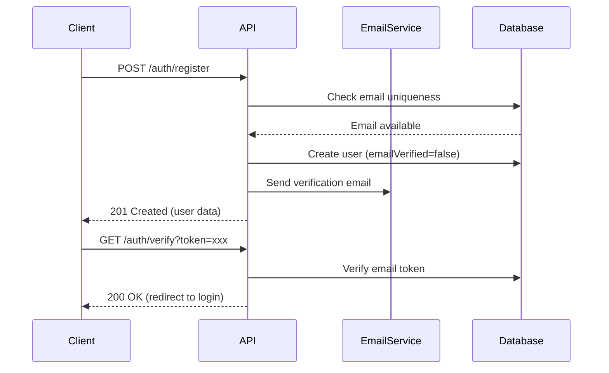
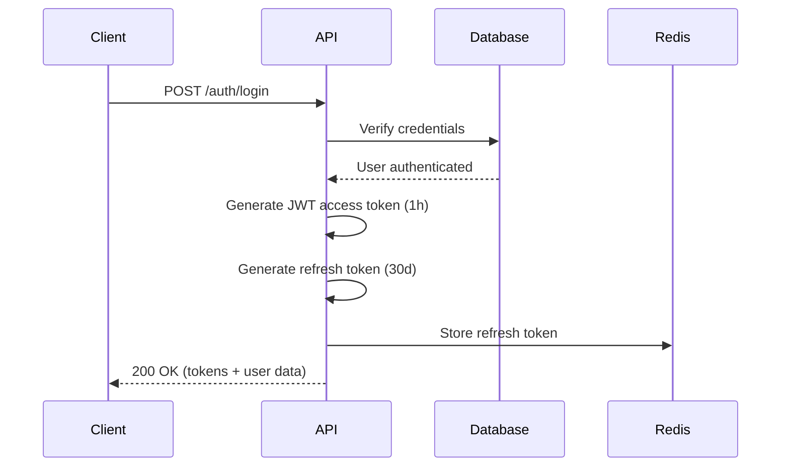
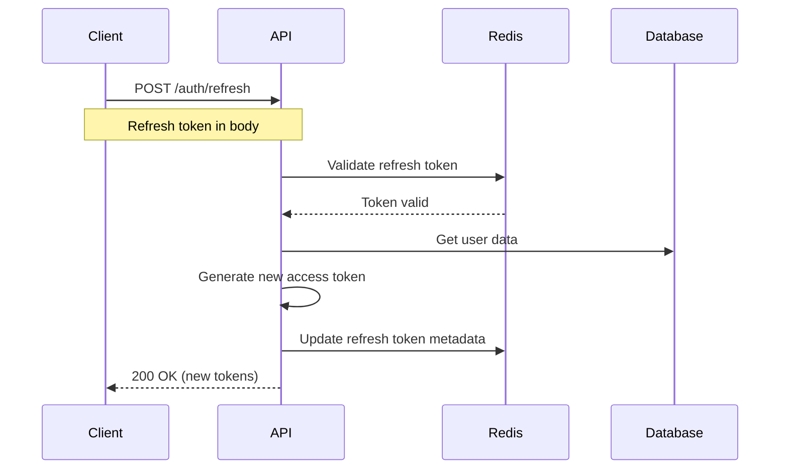

# Authentication & Authorization Guide

## Overview

The API uses a hybrid authentication system combining OAuth 2.0 and JWT (JSON Web Tokens) for secure, stateless authentication with optional multi-factor authentication (MFA).

## Authentication Flow

### 1. Registration Flow



**Example Registration Request:**

```bash
curl -X POST https://api.example.com/v1/auth/register \
  -H "Content-Type: application/json" \
  -d '{
    "email": "user@example.com",
    "password": "SecureP@ssw0rd123",
    "firstName": "John",
    "lastName": "Doe"
  }'
```

**Response:**

```json
{
  "id": "usr_1a2b3c4d5e",
  "email": "user@example.com",
  "firstName": "John",
  "lastName": "Doe",
  "emailVerified": false,
  "createdAt": "2025-01-17T10:30:00Z"
}
```

### 2. Login Flow (OAuth 2.0 + JWT)



**Example Login Request:**

```bash
curl -X POST https://api.example.com/v1/auth/login \
  -H "Content-Type: application/json" \
  -d '{
    "email": "user@example.com",
    "password": "SecureP@ssw0rd123"
  }'
```

**Response:**

```json
{
  "accessToken": "eyJhbGciOiJSUzI1NiIsInR5cCI6IkpXVCJ9.eyJzdWIiOiJ1c3JfMWEyYjNjNGQ1ZSIsImVtYWlsIjoidXNlckBleGFtcGxlLmNvbSIsInJvbGUiOiJtZW1iZXIiLCJvcmdJZCI6Im9yZ185ejh5N3g2dzV2IiwiaWF0IjoxNjQyNDE2MDAwLCJleHAiOjE2NDI0MTk2MDB9.signature",
  "refreshToken": "rt_a1b2c3d4e5f6g7h8i9j0k1l2m3n4o5p6",
  "expiresIn": 3600,
  "tokenType": "Bearer",
  "user": {
    "id": "usr_1a2b3c4d5e",
    "email": "user@example.com",
    "firstName": "John",
    "lastName": "Doe",
    "role": "member",
    "organizationId": "org_9z8y7x6w5v"
  }
}
```

### 3. Token Refresh Flow



**Example Refresh Request:**

```bash
curl -X POST https://api.example.com/v1/auth/refresh \
  -H "Content-Type: application/json" \
  -d '{
    "refreshToken": "rt_a1b2c3d4e5f6g7h8i9j0k1l2m3n4o5p6"
  }'
```

## JWT Token Structure

### Access Token (1 hour expiry)

```json
{
  "header": {
    "alg": "RS256",
    "typ": "JWT",
    "kid": "key-2025-01"
  },
  "payload": {
    "sub": "usr_1a2b3c4d5e",
    "email": "user@example.com",
    "role": "member",
    "orgId": "org_9z8y7x6w5v",
    "permissions": ["read:projects", "write:projects"],
    "iat": 1642416000,
    "exp": 1642419600,
    "iss": "api.example.com",
    "aud": "api.example.com"
  }
}
```

### Refresh Token (30 days expiry)

- Stored in Redis with user metadata
- Single-use token (rotates on refresh)
- Revocable via logout endpoint
- Format: `rt_` prefix + 32-char alphanumeric

## Authorization

### Role-Based Access Control (RBAC)

| Role       | Permissions              | Description                 |
| ---------- | ------------------------ | --------------------------- |
| **admin**  | Full access              | Organization administrators |
| **member** | Read/Write own resources | Standard users              |
| **viewer** | Read-only access         | Limited read permissions    |

### Permission Scopes

```
read:users        - View user profiles
write:users       - Create/update users
delete:users      - Delete users (admin only)
read:projects     - View projects
write:projects    - Create/update projects
read:analytics    - Access analytics data
admin:org         - Manage organization settings
```

### Endpoint Authorization Examples

```yaml
# Public endpoints (no auth required)
POST /auth/register
POST /auth/login
POST /auth/refresh

# Authenticated endpoints (valid JWT required)
GET /users              # Any authenticated user
GET /users/{userId}     # Own profile or admin
PATCH /users/{userId}   # Own profile or admin
DELETE /users/{userId}  # Admin only

# Admin-only endpoints
POST /users             # Create user
DELETE /organizations   # Delete organization
```

## Multi-Factor Authentication (MFA)

### Enable MFA

```bash
# 1. Generate MFA secret
curl -X POST https://api.example.com/v1/auth/mfa/setup \
  -H "Authorization: Bearer {accessToken}"

# Response includes QR code and secret
{
  "secret": "JBSWY3DPEHPK3PXP",
  "qrCode": "data:image/png;base64,iVBORw0KG...",
  "backupCodes": ["12345678", "87654321", ...]
}

# 2. Verify and enable MFA
curl -X POST https://api.example.com/v1/auth/mfa/verify \
  -H "Authorization: Bearer {accessToken}" \
  -d '{"code": "123456"}'
```

### Login with MFA

```bash
curl -X POST https://api.example.com/v1/auth/login \
  -H "Content-Type: application/json" \
  -d '{
    "email": "user@example.com",
    "password": "SecureP@ssw0rd123",
    "mfaCode": "123456"
  }'
```

## OAuth 2.0 Integration

### Authorization Code Flow

**1. Authorization Request:**

```
GET https://api.example.com/oauth/authorize?
  response_type=code&
  client_id=app_xyz123&
  redirect_uri=https://app.example.com/callback&
  scope=read+write&
  state=random_state_string
```

**2. Exchange Code for Tokens:**

```bash
curl -X POST https://api.example.com/oauth/token \
  -H "Content-Type: application/x-www-form-urlencoded" \
  -d "grant_type=authorization_code" \
  -d "code=AUTH_CODE_HERE" \
  -d "client_id=app_xyz123" \
  -d "client_secret=SECRET" \
  -d "redirect_uri=https://app.example.com/callback"
```

**3. Token Response:**

```json
{
  "access_token": "eyJhbGci...",
  "refresh_token": "rt_abc123...",
  "token_type": "Bearer",
  "expires_in": 3600,
  "scope": "read write"
}
```

## Security Best Practices

### Token Storage

**Client-Side (Web Apps):**

- Store access tokens in memory only
- Store refresh tokens in httpOnly cookies (secure, sameSite=strict)
- Never store tokens in localStorage (XSS vulnerable)

**Mobile Apps:**

- Use secure keychain/keystore
- Implement biometric authentication
- Clear tokens on logout

### Token Transmission

```bash
# ✅ Correct: Bearer token in Authorization header
curl -X GET https://api.example.com/v1/users \
  -H "Authorization: Bearer eyJhbGci..."

# ❌ Wrong: Token in query parameter
curl -X GET https://api.example.com/v1/users?token=eyJhbGci...
```

### Password Requirements

- Minimum 8 characters
- At least one uppercase letter
- At least one lowercase letter
- At least one number
- At least one special character (@$!%\*?&)
- Maximum 128 characters

**Password Hashing:**

- Algorithm: Argon2id
- Memory: 64 MB
- Iterations: 3
- Parallelism: 4
- Salt: 32 bytes (random)

## Rate Limiting

Authentication endpoints have stricter rate limits:

| Endpoint               | Rate Limit  | Window     |
| ---------------------- | ----------- | ---------- |
| `/auth/login`          | 5 requests  | 15 minutes |
| `/auth/register`       | 3 requests  | 1 hour     |
| `/auth/refresh`        | 20 requests | 1 hour     |
| `/auth/password-reset` | 3 requests  | 1 hour     |

## Error Handling

### Common Authentication Errors

```json
// Invalid credentials
{
  "error": "Unauthorized",
  "message": "Invalid email or password",
  "statusCode": 401,
  "requestId": "req_abc123"
}

// MFA required
{
  "error": "MFARequired",
  "message": "Multi-factor authentication code required",
  "statusCode": 401,
  "mfaRequired": true,
  "requestId": "req_def456"
}

// Token expired
{
  "error": "TokenExpired",
  "message": "Access token has expired",
  "statusCode": 401,
  "requestId": "req_ghi789"
}

// Invalid token
{
  "error": "InvalidToken",
  "message": "Malformed or invalid authentication token",
  "statusCode": 401,
  "requestId": "req_jkl012"
}

// Insufficient permissions
{
  "error": "Forbidden",
  "message": "You do not have permission to access this resource",
  "statusCode": 403,
  "requiredRole": "admin",
  "currentRole": "member",
  "requestId": "req_mno345"
}
```

## Testing Authentication

### Postman Collection Variables

```json
{
  "api_url": "https://api.example.com/v1",
  "access_token": "{{access_token}}",
  "refresh_token": "{{refresh_token}}"
}
```

### Pre-request Script (Auto-refresh)

```javascript
// Automatically refresh token if expired
const expiresAt = pm.environment.get("token_expires_at");
const now = Date.now();

if (expiresAt && now >= expiresAt) {
  pm.sendRequest(
    {
      url: pm.environment.get("api_url") + "/auth/refresh",
      method: "POST",
      header: { "Content-Type": "application/json" },
      body: {
        mode: "raw",
        raw: JSON.stringify({
          refreshToken: pm.environment.get("refresh_token"),
        }),
      },
    },
    (err, res) => {
      if (!err) {
        const data = res.json();
        pm.environment.set("access_token", data.accessToken);
        pm.environment.set("refresh_token", data.refreshToken);
        pm.environment.set(
          "token_expires_at",
          Date.now() + data.expiresIn * 1000,
        );
      }
    },
  );
}
```

## Session Management

### Logout

```bash
# Invalidate refresh token
curl -X POST https://api.example.com/v1/auth/logout \
  -H "Authorization: Bearer {accessToken}" \
  -d '{"refreshToken": "rt_abc123..."}'
```

### Logout All Sessions

```bash
# Invalidate all user sessions
curl -X POST https://api.example.com/v1/auth/logout-all \
  -H "Authorization: Bearer {accessToken}"
```

### Session Activity

```bash
# List active sessions
curl -X GET https://api.example.com/v1/auth/sessions \
  -H "Authorization: Bearer {accessToken}"

# Response
{
  "sessions": [
    {
      "id": "sess_abc123",
      "device": "Chrome 120 on macOS",
      "ipAddress": "192.168.1.1",
      "location": "San Francisco, CA",
      "lastActive": "2025-01-17T10:30:00Z",
      "current": true
    }
  ]
}
```

## Compliance & Auditing

### Audit Events

All authentication events are logged:

- Login attempts (success/failure)
- Password changes
- MFA enable/disable
- Token refresh
- Session logout
- Permission changes

### GDPR Compliance

- Right to access: Export user authentication data
- Right to deletion: Purge all tokens and sessions
- Data retention: Audit logs retained for 90 days

## Additional Resources

- [Rate Limiting Guide](./rate-limiting.md)
- [Error Handling Guide](./error-handling.md)
- [API Versioning Strategy](./versioning.md)
- [Security Best Practices](../runbooks/security-practices.md)
