# C4 Container Diagram - Enterprise API Platform

## Container Overview

This diagram shows the containers (applications and data stores) that make up the Enterprise API Platform.

```mermaid
C4Container
    title Container Diagram - Enterprise API Platform

    Person(user, "User", "End user or API consumer")

    Container_Boundary(platform, "Enterprise API Platform") {
        Container(webApp, "Web Application", "React/Next.js", "Provides UI for user management and analytics")
        Container(apiGateway, "API Gateway", "Kong/NGINX", "Routes requests, handles auth, rate limiting")
        Container(authService, "Authentication Service", "Node.js/Express", "Handles user authentication and JWT management")
        Container(userService, "User Service", "Node.js/Express", "User CRUD operations and profile management")
        Container(orgService, "Organization Service", "Node.js/Express", "Multi-tenant organization management")
        Container(projectService, "Project Service", "Node.js/Express", "Project and resource management")
        Container(webhookService, "Webhook Service", "Node.js/Express", "Manages webhook subscriptions and delivery")
        Container(analyticsService, "Analytics Service", "Python/FastAPI", "Processes and aggregates analytics data")
        Container(notificationService, "Notification Service", "Node.js/Express", "Sends emails, SMS, and push notifications")

        ContainerDb(primaryDb, "Primary Database", "PostgreSQL", "Stores users, organizations, projects")
        ContainerDb(cacheDb, "Cache Store", "Redis", "Caches sessions, rate limits, temporary data")
        ContainerDb(analyticsDb, "Analytics Database", "ClickHouse", "Stores time-series analytics data")
        ContainerDb(searchDb, "Search Engine", "Elasticsearch", "Full-text search and indexing")
        Container(messageQueue, "Message Queue", "RabbitMQ/SQS", "Async job processing and event streaming")
        ContainerDb(objectStorage, "Object Storage", "AWS S3", "Stores files and backups")
    }

    System_Ext(emailService, "Email Service", "SendGrid/AWS SES")
    System_Ext(smsService, "SMS Service", "Twilio")
    System_Ext(paymentService, "Payment Gateway", "Stripe")
    System_Ext(monitoring, "Monitoring", "DataDog")

    Rel(user, webApp, "Uses", "HTTPS")
    Rel(user, apiGateway, "Makes API calls", "HTTPS/JSON")

    Rel(webApp, apiGateway, "Calls", "HTTPS/REST")
    Rel(apiGateway, authService, "Routes to", "HTTP")
    Rel(apiGateway, userService, "Routes to", "HTTP")
    Rel(apiGateway, orgService, "Routes to", "HTTP")
    Rel(apiGateway, projectService, "Routes to", "HTTP")
    Rel(apiGateway, webhookService, "Routes to", "HTTP")

    Rel(authService, primaryDb, "Reads/Writes", "TCP/SQL")
    Rel(authService, cacheDb, "Reads/Writes", "TCP/Redis Protocol")

    Rel(userService, primaryDb, "Reads/Writes", "TCP/SQL")
    Rel(userService, searchDb, "Indexes users", "HTTP/REST")
    Rel(userService, messageQueue, "Publishes events", "AMQP")

    Rel(orgService, primaryDb, "Reads/Writes", "TCP/SQL")
    Rel(projectService, primaryDb, "Reads/Writes", "TCP/SQL")

    Rel(webhookService, primaryDb, "Reads webhook configs", "TCP/SQL")
    Rel(webhookService, messageQueue, "Consumes events", "AMQP")

    Rel(analyticsService, analyticsDb, "Writes metrics", "TCP/SQL")
    Rel(analyticsService, messageQueue, "Consumes events", "AMQP")

    Rel(notificationService, emailService, "Sends emails", "HTTPS")
    Rel(notificationService, smsService, "Sends SMS", "HTTPS")
    Rel(notificationService, messageQueue, "Consumes jobs", "AMQP")

    Rel(userService, objectStorage, "Stores avatars", "HTTPS/S3 API")
    Rel(projectService, objectStorage, "Stores files", "HTTPS/S3 API")

    Rel(apiGateway, monitoring, "Sends metrics", "HTTPS")
    Rel(authService, monitoring, "Sends metrics", "HTTPS")

    UpdateLayoutConfig($c4ShapeInRow="4", $c4BoundaryInRow="1")
```



## Container Descriptions

### 1. Web Application

**Technology**: React 18 + Next.js 14

**Purpose**: User-facing web interface

**Responsibilities:**

- User authentication UI
- Dashboard and analytics visualization
- User and organization management
- Project management interface
- Admin panel

**Deployment:**

- Static site hosted on CDN (Vercel/CloudFront)
- Server-side rendering for SEO
- Client-side routing with React Router

**Endpoints:**

- `/` - Dashboard
- `/login` - Authentication
- `/users` - User management
- `/organizations` - Organization management
- `/admin` - Admin panel

---

### 2. API Gateway

**Technology**: Kong API Gateway / NGINX Plus

**Purpose**: Central entry point for all API traffic

**Responsibilities:**

- Request routing to microservices
- Authentication and authorization
- Rate limiting (token bucket algorithm)
- Request/response transformation
- API versioning (/v1, /v2)
- SSL/TLS termination
- CORS handling
- Request logging

**Key Features:**

- Plugin architecture (auth, rate limiting, logging)
- Service mesh integration
- Health checks and circuit breakers
- WebSocket support

**Configuration:**

```yaml
services:
  - name: auth-service
    url: http://auth-service:3000
    routes:
      - paths: [/v1/auth]
    plugins:
      - name: rate-limiting
        config:
          minute: 60
```

---

### 3. Authentication Service

**Technology**: Node.js + Express + Passport.js

**Purpose**: User authentication and token management

**Responsibilities:**

- User registration and login
- JWT token generation and validation
- Refresh token management
- OAuth 2.0 provider integration
- MFA (TOTP) support
- Password reset flows
- Session management

**Database Tables:**

- `users` - User accounts
- `refresh_tokens` - Active refresh tokens
- `oauth_clients` - OAuth client applications
- `mfa_secrets` - MFA configuration

**Key Dependencies:**

- `jsonwebtoken` - JWT generation/validation
- `bcrypt` - Password hashing
- `passport` - Authentication middleware
- `speakeasy` - TOTP for MFA

**Performance:**

- Token generation: < 50ms
- Token validation: < 10ms (Redis cached)
- Login throughput: 1000 req/s

---

### 4. User Service

**Technology**: Node.js + Express + TypeORM

**Purpose**: User profile and account management

**Responsibilities:**

- User CRUD operations
- Profile management
- Role-based access control
- User search (Elasticsearch)
- Account deletion (GDPR compliance)
- User activity logging

**API Endpoints:**

- `GET /users` - List users (paginated)
- `GET /users/:id` - Get user details
- `POST /users` - Create user
- `PATCH /users/:id` - Update user
- `DELETE /users/:id` - Delete user

**Database Schema:**

```sql
CREATE TABLE users (
  id VARCHAR(20) PRIMARY KEY,
  email VARCHAR(255) UNIQUE NOT NULL,
  password_hash VARCHAR(255) NOT NULL,
  first_name VARCHAR(100),
  last_name VARCHAR(100),
  role VARCHAR(20) DEFAULT 'member',
  status VARCHAR(20) DEFAULT 'active',
  organization_id VARCHAR(20),
  created_at TIMESTAMP DEFAULT NOW(),
  updated_at TIMESTAMP DEFAULT NOW()
);
```

---

### 5. Organization Service

**Technology**: Node.js + Express + TypeORM

**Purpose**: Multi-tenant organization management

**Responsibilities:**

- Organization CRUD operations
- Member management
- Role and permission management
- Billing and subscription management
- Organization settings
- Team collaboration features

**API Endpoints:**

- `GET /organizations` - List organizations
- `POST /organizations` - Create organization
- `GET /organizations/:id/members` - List members
- `POST /organizations/:id/members` - Add member
- `DELETE /organizations/:id/members/:userId` - Remove member

**Multi-tenancy Model:**

- Shared database with `organization_id` partition key
- Row-level security policies
- Tenant isolation via middleware

---

### 6. Project Service

**Technology**: Node.js + Express + TypeORM

**Purpose**: Project and resource lifecycle management

**Responsibilities:**

- Project CRUD operations
- Resource management
- Project collaboration
- File uploads (S3 integration)
- Project analytics
- Access control

**API Endpoints:**

- `GET /projects` - List projects
- `POST /projects` - Create project
- `GET /projects/:id` - Get project details
- `PATCH /projects/:id` - Update project
- `DELETE /projects/:id` - Delete project

---

### 7. Webhook Service

**Technology**: Node.js + Express + Bull Queue

**Purpose**: Webhook subscription and delivery management

**Responsibilities:**

- Webhook subscription CRUD
- Event filtering and routing
- Webhook delivery with retry logic
- Signature verification (HMAC)
- Delivery status tracking
- Rate limiting per endpoint

**Webhook Flow:**

```
1. User creates webhook subscription
2. Event occurs (user.created, project.updated, etc.)
3. Event published to message queue
4. Webhook service consumes event
5. Filters subscriptions matching event
6. Delivers to subscriber endpoint with retry
7. Logs delivery status
```

**Retry Strategy:**

- Exponential backoff: 1min, 5min, 15min
- Max retries: 3 attempts
- Dead letter queue for failed deliveries

---

### 8. Analytics Service

**Technology**: Python + FastAPI + Pandas

**Purpose**: Event processing and analytics aggregation

**Responsibilities:**

- Real-time event ingestion
- Metrics aggregation (hourly, daily, monthly)
- Custom analytics queries
- Data export (CSV, JSON)
- Usage reports
- Anomaly detection

**Event Processing Pipeline:**

```
1. Events published to message queue
2. Analytics service consumes events
3. Validates and enriches event data
4. Writes to ClickHouse (time-series DB)
5. Aggregates metrics (hourly rollups)
6. Exposes query API for dashboards
```

**Supported Events:**

- `api.request` - API usage tracking
- `user.login` - Authentication events
- `project.created` - Resource events
- Custom events via `/analytics/events`

---

### 9. Notification Service

**Technology**: Node.js + Express + Bull Queue

**Purpose**: Multi-channel notification delivery

**Responsibilities:**

- Email delivery (SendGrid)
- SMS delivery (Twilio)
- Push notifications (FCM/APNS)
- Template management
- Delivery status tracking
- Notification preferences

**Notification Types:**

- Transactional (verification, password reset)
- Marketing (newsletters, promotions)
- System alerts (downtime, security)
- In-app notifications

## Data Stores

### Primary Database (PostgreSQL)

**Purpose**: Primary relational data storage

**Specifications:**

- Version: PostgreSQL 15
- Instance: db.r6g.xlarge (4 vCPU, 32 GB RAM)
- Storage: 1 TB SSD (provisioned IOPS)
- Replication: Multi-AZ with read replicas
- Backup: Daily snapshots + PITR (7 days)

**Key Tables:**

- `users` - User accounts
- `organizations` - Organizations
- `projects` - Projects and resources
- `webhooks` - Webhook subscriptions
- `audit_logs` - Audit trail

**Performance:**

- Read queries: < 50ms p95
- Write queries: < 100ms p95
- Connections: 500 max (connection pooling)

---

### Cache Store (Redis)

**Purpose**: High-speed caching and session storage

**Specifications:**

- Version: Redis 7.0
- Instance: cache.r6g.large (2 vCPU, 13 GB RAM)
- Persistence: AOF + RDB snapshots
- Replication: Master-replica with auto-failover

**Use Cases:**

- Session storage (JWT refresh tokens)
- Rate limiting counters
- API response caching
- Pub/sub for real-time features
- Distributed locks

**Cache Strategies:**

- Cache-aside for database queries
- Write-through for critical data
- TTL: 5min (API responses), 30min (user sessions)

---

### Analytics Database (ClickHouse)

**Purpose**: Time-series analytics and reporting

**Specifications:**

- Version: ClickHouse 23.x
- Instance: 3-node cluster
- Storage: 500 GB per node (columnar compression)
- Retention: 90 days (raw events), 2 years (aggregates)

**Optimizations:**

- Columnar storage for fast aggregations
- Materialized views for pre-aggregation
- Partitioning by date (daily partitions)
- Data compression (6:1 ratio)

---

### Search Engine (Elasticsearch)

**Purpose**: Full-text search and indexing

**Specifications:**

- Version: Elasticsearch 8.x
- Cluster: 3 nodes (1 master, 2 data nodes)
- Storage: 200 GB per node
- Replication: 1 replica per index

**Indexed Collections:**

- Users (email, name search)
- Projects (name, description search)
- Organizations (name, domain search)

**Search Features:**

- Fuzzy matching
- Autocomplete
- Faceted search
- Highlighting

---

### Message Queue (RabbitMQ / AWS SQS)

**Purpose**: Asynchronous job processing and event streaming

**Specifications:**

- Technology: RabbitMQ 3.12 (self-hosted) / AWS SQS (managed)
- Throughput: 10,000 messages/sec
- Persistence: Durable queues with disk persistence

**Queues:**

- `events` - Domain events (user.created, etc.)
- `webhooks` - Webhook delivery jobs
- `notifications` - Email/SMS jobs
- `analytics` - Analytics event processing

**Message Format:**

```json
{
  "eventType": "user.created",
  "timestamp": "2025-01-17T10:30:00Z",
  "payload": {
    "userId": "usr_123",
    "email": "user@example.com"
  },
  "metadata": {
    "correlationId": "req_abc123",
    "source": "user-service"
  }
}
```

---

### Object Storage (AWS S3)

**Purpose**: File and backup storage

**Specifications:**

- Buckets: `prod-user-uploads`, `prod-project-files`, `prod-backups`
- Storage Class: S3 Standard (hot data), S3 Glacier (archives)
- Replication: Cross-region replication (us-east-1 → us-west-2)
- Encryption: AES-256 (server-side encryption)

**Use Cases:**

- User avatars and profile images
- Project file attachments
- Database backups
- Log archives

## Communication Patterns

### Synchronous (REST)

```
Client → API Gateway → Microservice → Database → Response
```

**Use Cases:**

- CRUD operations
- Real-time data retrieval
- User-facing API calls

---

### Asynchronous (Message Queue)

```
Service A → Publishes Event → Queue → Service B Consumes
```

**Use Cases:**

- Webhook delivery
- Email sending
- Analytics processing
- Background jobs

---

### Event-Driven Architecture

```
User Service → user.created event → [Analytics, Notification, Webhook] Services
```

**Benefits:**

- Loose coupling between services
- Scalable event processing
- Audit trail and replay capability

## Deployment Architecture

```
┌─────────────────────────────────────────┐
│ Kubernetes Cluster (EKS)                │
│                                         │
│  ┌─────────────┐  ┌─────────────┐     │
│  │ API Gateway │  │ Auth Service│     │
│  │ (3 pods)    │  │ (3 pods)    │     │
│  └─────────────┘  └─────────────┘     │
│                                         │
│  ┌─────────────┐  ┌─────────────┐     │
│  │User Service │  │ Org Service │     │
│  │ (5 pods)    │  │ (3 pods)    │     │
│  └─────────────┘  └─────────────┘     │
│                                         │
│  ┌───────────────────────────┐         │
│  │ Horizontal Pod Autoscaler │         │
│  │ CPU > 70% → Scale up       │         │
│  └───────────────────────────┘         │
└─────────────────────────────────────────┘
```

## Additional Resources

- [C4 Context Diagram](./c4-context-diagram.md)
- [C4 Component Diagram](./c4-component-diagram.md)
- [System Architecture](./system-architecture.md)
- [Deployment Runbook](../runbooks/deployment.md)
