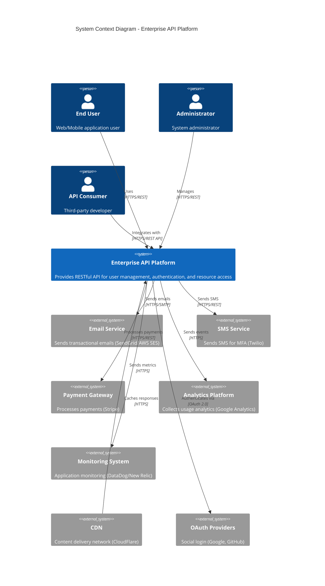

# C4 Context Diagram - Enterprise API Platform

## System Context

This diagram shows the Enterprise API Platform and its relationship with users and external systems.



## System Description

### Enterprise API Platform

A modern, scalable RESTful API platform providing:

- **Authentication & Authorization**: OAuth 2.0, JWT, RBAC, MFA
- **User Management**: CRUD operations for users and profiles
- **Organization Management**: Multi-tenant organization support
- **Project Management**: Resource and project lifecycle management
- **Analytics**: Event tracking and usage analytics
- **Webhook System**: Real-time event notifications

### Key Characteristics

| Characteristic     | Details                        |
| ------------------ | ------------------------------ |
| **Architecture**   | Microservices with API Gateway |
| **Protocol**       | HTTPS/REST (JSON)              |
| **Authentication** | OAuth 2.0 + JWT                |
| **Availability**   | 99.9% SLA (High Availability)  |
| **Scalability**    | Horizontal auto-scaling        |
| **Security**       | TLS 1.3, WAF, DDoS protection  |

## External Systems

### 1. Email Service (SendGrid/AWS SES)

**Purpose**: Transactional email delivery

**Integration Points:**

- User verification emails
- Password reset emails
- Notification emails
- Marketing communications

**Protocol**: HTTPS API / SMTP

### 2. SMS Service (Twilio)

**Purpose**: SMS delivery for MFA and notifications

**Integration Points:**

- MFA verification codes
- Account security alerts
- Critical notifications

**Protocol**: HTTPS REST API

### 3. Payment Gateway (Stripe)

**Purpose**: Payment processing and subscription management

**Integration Points:**

- Subscription payments
- Usage-based billing
- Payment method management
- Invoice generation

**Protocol**: HTTPS REST API (PCI DSS compliant)

### 4. Analytics Platform

**Purpose**: Usage tracking and business intelligence

**Integration Points:**

- User behavior tracking
- API usage metrics
- Conversion funnels
- Custom events

**Protocol**: HTTPS (Google Analytics, Segment)

### 5. Monitoring System

**Purpose**: Application performance monitoring and alerting

**Integration Points:**

- Error tracking (Sentry)
- Performance metrics (DataDog)
- Uptime monitoring (PagerDuty)
- Log aggregation (ELK Stack)

**Protocol**: HTTPS REST API / Log shipping

### 6. CDN (CloudFlare)

**Purpose**: Content delivery and DDoS protection

**Integration Points:**

- API response caching
- Static asset delivery
- WAF (Web Application Firewall)
- DDoS mitigation

**Protocol**: HTTPS with origin pull

### 7. OAuth Providers

**Purpose**: Social authentication and SSO

**Supported Providers:**

- Google OAuth 2.0
- GitHub OAuth
- Microsoft Azure AD
- Okta SSO (Enterprise)

**Protocol**: OAuth 2.0 Authorization Code Flow

## User Personas

### End User

**Description**: Regular application users accessing the platform through web or mobile apps

**Key Activities:**

- Sign up and authentication
- Manage profile
- Access resources
- View analytics

**Primary Interactions:**

- Authentication endpoints (`/auth/*`)
- User endpoints (`/users/*`)
- Project endpoints (`/projects/*`)

### Administrator

**Description**: System administrators managing platform configuration and users

**Key Activities:**

- User management
- Organization administration
- System configuration
- Access control management

**Primary Interactions:**

- Admin endpoints (`/admin/*`)
- Organization management (`/organizations/*`)
- User management (`/users/*`)
- Analytics dashboards

### API Consumer (Developer)

**Description**: Third-party developers integrating with the API

**Key Activities:**

- API integration
- Webhook configuration
- OAuth app management
- API key management

**Primary Interactions:**

- All public API endpoints
- Webhook endpoints (`/webhooks/*`)
- OAuth endpoints (`/oauth/*`)
- Developer portal

## Data Flow

### High-Level Request Flow

```
1. Client Request
   ↓
2. CDN (Cache Check)
   ↓
3. Load Balancer
   ↓
4. API Gateway (Auth/Rate Limiting)
   ↓
5. Application Service
   ↓
6. Database / External Services
   ↓
7. Response to Client
```

### Authentication Flow

```
1. User → API: Login Request
2. API → Database: Verify Credentials
3. API → User: JWT Access Token
4. User → API: Authenticated Request (Bearer Token)
5. API → JWT Validator: Verify Token
6. API → Database: Fetch Resource
7. API → User: Response
```

## Security Boundaries

### Trust Boundaries

```
┌─────────────────────────────────────┐
│ Public Internet (Untrusted)         │
│  - End Users                         │
│  - Third-party Developers            │
└──────────────┬──────────────────────┘
               │ HTTPS/TLS 1.3
┌──────────────▼──────────────────────┐
│ DMZ (Semi-trusted)                   │
│  - CDN                               │
│  - WAF                               │
│  - Load Balancer                     │
└──────────────┬──────────────────────┘
               │ Internal Network
┌──────────────▼──────────────────────┐
│ Application Layer (Trusted)          │
│  - API Gateway                       │
│  - Application Services              │
│  - Authentication Service            │
└──────────────┬──────────────────────┘
               │ Private Network
┌──────────────▼──────────────────────┐
│ Data Layer (Highly Restricted)      │
│  - PostgreSQL (Primary DB)           │
│  - Redis (Cache/Sessions)            │
│  - S3 (File Storage)                 │
└─────────────────────────────────────┘
```

## Deployment Environment

### Production Infrastructure

- **Cloud Provider**: AWS (Primary), GCP (Backup)
- **Regions**: us-east-1 (Primary), us-west-2 (DR)
- **Availability Zones**: Multi-AZ deployment (3 AZs)
- **Container Orchestration**: Kubernetes (EKS)
- **CI/CD**: GitHub Actions + ArgoCD
- **Infrastructure as Code**: Terraform

### Capacity Planning

| Metric            | Current | Peak    | Scaling Threshold     |
| ----------------- | ------- | ------- | --------------------- |
| **Requests/sec**  | 1,000   | 5,000   | 3,000 req/s           |
| **Active Users**  | 100,000 | 500,000 | 300,000 users         |
| **Database Size** | 500 GB  | 2 TB    | 1.5 TB                |
| **API Servers**   | 10 pods | 50 pods | Auto-scale at 70% CPU |

## Compliance & Regulations

- **GDPR**: EU data protection compliance
- **SOC 2 Type II**: Security and availability
- **HIPAA**: Healthcare data (optional add-on)
- **PCI DSS**: Payment card data (via Stripe)
- **ISO 27001**: Information security management

## Additional Resources

- [C4 Container Diagram](./c4-container-diagram.md)
- [C4 Component Diagram](./c4-component-diagram.md)
- [System Architecture](./system-architecture.md)
- [Security Architecture](./security-architecture.md)
