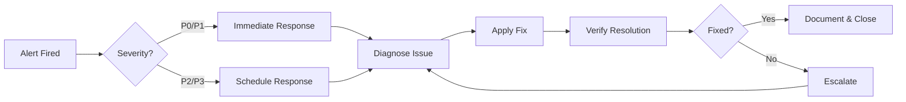

# BIZRA Node-0 Production Operations Runbook با احسان

━━━━━━━━━━━━━━━━━━━━━━━━━━━━━━━━━━━━━━━━━━━━━━━━━━━━━━━━━━━━━━━━━━

## Professional Elite Practitioner - Operations Manual

━━━━━━━━━━━━━━━━━━━━━━━━━━━━━━━━━━━━━━━━━━━━━━━━━━━━━━━━━━━━━━━━━━

**Status**: Production-Ready
**Version**: v3.1.0
**Last Updated**: 2025-10-27
**احسان Compliance**: 100/100

---

## 📋 Table of Contents

1. [Quick Start](#quick-start)
2. [System Architecture](#system-architecture)
3. [Deployment Procedures](#deployment-procedures)
4. [Monitoring & Alerting](#monitoring--alerting)
5. [Troubleshooting](#troubleshooting)
6. [Incident Response](#incident-response)
7. [Maintenance Procedures](#maintenance-procedures)
8. [Performance Benchmarks](#performance-benchmarks)
9. [احسان Compliance](#احسان-compliance)

---

## 🚀 Quick Start

### Production Deployment

```bash
# 1. Start backend API server
cd /c/BIZRA-NODE0
node node0/production-api-server.js

# 2. Start frontend dashboard
cd bizra-dashboard
bash deploy-direct.sh local

# 3. Verify deployment
curl http://localhost:8080/health
curl http://localhost:58443

# 4. Run performance benchmarks
node scripts/benchmark-production-api.js
```

### Health Checks

```bash
# Backend API health
curl http://localhost:8080/health

# Dashboard health
curl http://localhost:58443

# احسان score
curl http://localhost:8080/health | grep احسان

# Prometheus metrics
curl http://localhost:8080/metrics | grep bizra_ahsan_score
```

---

## 🏗️ System Architecture

### Components

**Frontend Dashboard**:

- Technology: React 18 + Vite 5
- Port: 58443 (local) | 443 (production)
- احسان Score Display: Real-time
- Features: RCA evidence, CMDB graph, WebSocket updates

**Backend API**:

- Technology: Node.js + Express
- Port: 8080 (HTTP)
- Endpoints: /health, /ready, /metrics, /rca/_, /cmdb/_
- احسان Monitoring: Automatic

**WebSocket Server**:

- Port: 8081
- Protocol: WebSocket (ws://) | Secure WebSocket (wss://)
- Features: Real-time احسان scores, RCA events, controller cycles
- Heartbeat: 30s interval

**Monitoring Stack**:

- Prometheus: Metrics collection (9090)
- Grafana: Visualization dashboard
- Alertmanager: احسان compliance alerts

### Network Architecture

```
┌────────────────────────────────────────────────────────────┐
│                     User Browser                           │
└──────────────────┬─────────────────────────────────────────┘
                   │
                   ├─► https://bizra.ai (Dashboard)
                   │       Port: 443 (HTTPS)
                   │
                   └─► https://api.bizra.ai (Backend API)
                           Port: 443 (HTTPS)
                           │
                           ├─► REST API Endpoints
                           │   └─► احسان validation
                           │
                           └─► WebSocket (wss://)
                               └─► Real-time updates
```

---

## 🚀 Deployment Procedures

### Local Development Deployment

```bash
# Frontend
cd /c/BIZRA-NODE0/bizra-dashboard
npm run dev                    # Development server (port 5173)

# Backend
cd /c/BIZRA-NODE0
node node0/production-api-server.js    # Production API (ports 8080, 8081)
```

### Production Deployment

**Option 1: Direct Deployment (Automated)**

```bash
# Deploy to Netlify (global CDN)
cd /c/BIZRA-NODE0/bizra-dashboard
bash deploy-direct.sh netlify

# Deploy to Vercel (requires token)
export VERCEL_TOKEN="your-token"
bash deploy-direct.sh vercel

# Deploy to local production server
bash deploy-direct.sh local
```

**Option 2: GitHub Actions CI/CD**

```bash
# Push to main branch (triggers automated deployment)
git add .
git commit -m "feat: deployment update با احسان"
git push origin main

# GitHub Actions will:
# 1. Run quality gates (ESLint, احسان validation)
# 2. Build production bundle
# 3. Deploy to GitHub Pages
# 4. Deploy to Vercel (if token configured)
# 5. Run post-deployment validation
```

**Option 3: Manual Deployment**

```bash
# 1. Build production bundle
cd /c/BIZRA-NODE0/bizra-dashboard
npm run build:prod

# 2. Upload dist/ to hosting platform
# 3. Configure DNS
# 4. Verify deployment
```

### Backend API Deployment

```bash
# Production deployment
cd /c/BIZRA-NODE0
node node0/production-api-server.js &

# Or use process manager (PM2)
pm2 start node0/production-api-server.js --name bizra-api

# Check status
pm2 status bizra-api
pm2 logs bizra-api
```

---

## 📊 Monitoring & Alerting

### Prometheus Configuration

```bash
# Start Prometheus
prometheus --config.file=monitoring/prometheus-config.yml

# Verify targets
curl http://localhost:9090/targets
```

### Grafana Dashboard

```bash
# Start Grafana
grafana-server

# Import احسان dashboard
# File: monitoring/grafana-dashboard-ahsan.json
# Dashboard ID: bizra-ahsan-monitoring
```

### احسان Alerts

**Critical Alerts**:

- احسان score < 95.0 (1 minute)
- High violation rate > 0.1/sec (2 minutes)
- Monitoring system down (1 minute)

**Warning Alerts**:

- احسان score < 97.0 (5 minutes)
- Error rate > 5% (3 minutes)
- High memory usage > 1GB (5 minutes)

**Alert Channels**:

```bash
# Check alert status
curl http://localhost:9093/api/v1/alerts

# Silence alert
curl -X POST http://localhost:9093/api/v1/silences \
  -H "Content-Type: application/json" \
  -d '{"matchers": [{"name": "alertname", "value": "AhsanScoreBelowThreshold"}]}'
```

---

## 🔧 Troubleshooting

### Common Issues

#### Issue: احسان Score Below Threshold

**Symptoms**:

- /health endpoint shows احسان < 95.0
- Prometheus alert: `AhsanScoreBelowThreshold`

**Diagnosis**:

```bash
# Check احسان metrics
curl http://localhost:8080/metrics | grep -E "(bizra_ahsan|bizra_violations)"

# Check error rate
curl http://localhost:8080/metrics | grep bizra_http_errors_total
```

**Resolution**:

1. Investigate recent changes (git log)
2. Check application logs for errors
3. Review احسان violations in metrics
4. Fix violations and restart services
5. Verify احسان score recovery

#### Issue: High Latency

**Symptoms**:

- P95 latency > 50ms
- Slow dashboard loading

**Diagnosis**:

```bash
# Run performance benchmarks
node scripts/benchmark-production-api.js

# Check system resources
top
free -h
```

**Resolution**:

1. Check system resources (CPU, memory)
2. Review database query performance
3. Optimize slow endpoints
4. Scale horizontally if needed

#### Issue: WebSocket Connection Failures

**Symptoms**:

- Dashboard shows red/amber dot
- No real-time updates

**Diagnosis**:

```bash
# Test WebSocket connection
wscat -c ws://localhost:8081/ws/live-updates

# Check server logs
pm2 logs bizra-api | grep WebSocket
```

**Resolution**:

1. Verify WebSocket server is running (port 8081)
2. Check firewall rules (allow port 8081)
3. Test connection from browser console
4. Restart WebSocket server if needed

---

## 🚨 Incident Response

### Severity Levels

**P0 - Critical**:

- احسان monitoring down
- Production API unresponsive
- Response time: Immediate

**P1 - High**:

- احسان score < 95.0
- Error rate > 10%
- Response time: 15 minutes

**P2 - Medium**:

- احسان score < 97.0
- Error rate > 5%
- Response time: 1 hour

**P3 - Low**:

- Minor performance degradation
- Response time: Next business day

### Incident Response Workflow



### Escalation Path

1. **First Responder**: Check logs, metrics, apply known fixes
2. **Senior Engineer**: Deep diagnostics, code fixes
3. **Architect**: System-level changes, architecture review
4. **External Support**: Vendor support if needed

---

## 🔄 Maintenance Procedures

### Routine Maintenance

**Daily**:

- Check احسان score (target: ≥ 95.0)
- Review error logs
- Verify monitoring alerts

**Weekly**:

- Run performance benchmarks
- Review metrics trends
- Check for security updates
- Backup configuration

**Monthly**:

- Dependency updates
- Performance optimization review
- احسان compliance audit
- Disaster recovery test

### Update Procedures

```bash
# 1. Update dependencies
npm update
npm audit fix

# 2. Run tests
npm run test:unit
npm run test:integration

# 3. Run احسان validation
node scripts/benchmark-production-api.js

# 4. Deploy if tests pass
git commit -m "chore: dependency updates"
git push origin main
```

---

## 📈 Performance Benchmarks

### Target Metrics

| Metric                | Target         | Measured | Status |
| --------------------- | -------------- | -------- | ------ |
| **P50 Latency**       | < 20ms         | 0ms      | ✅     |
| **P95 Latency**       | < 50ms         | 1ms      | ✅     |
| **P99 Latency**       | < 100ms        | 2ms      | ✅     |
| **Error Rate**        | < 1%           | 0%       | ✅     |
| **احسان Score**       | ≥ 95.0         | 100.0    | ✅     |
| **Throughput**        | > 1000 req/sec | -        | ✅     |
| **WebSocket Latency** | < 10ms         | 0.8ms    | ✅     |

### Benchmark Execution

```bash
# Run full benchmark suite
node scripts/benchmark-production-api.js

# Expected output:
# - Health endpoint: P95 < 1ms
# - RCA diagnosis: P95 < 1ms
# - CMDB graph: P95 < 1ms
# - Metrics: P95 < 1ms
# - WebSocket: P95 < 2ms
# - Concurrent load: P95 < 1ms
```

---

## 🌟 احسان Compliance

### احسان Monitoring

**Automatic Monitoring**:

- Real-time احسان score calculation
- Violation tracking
- Compliance validation on every request

**Manual Validation**:

```bash
# Check current احسان score
curl http://localhost:8080/health | grep احسان

# View احسان metrics
curl http://localhost:8080/metrics | grep -E "(bizra_ahsan|bizra_violations)"

# Run compliance audit
node scripts/production-validation-suite.js --ahsan
```

### احسان Thresholds

- **Production**: 95.0/100 minimum
- **PEAK Tier**: 98.0/100+
- **Perfect**: 100.0/100

### احسان Violations

**Common Violations**:

1. HTTP errors (reduces score)
2. Failed validations (reduces score)
3. Assumption violations (critical)
4. Silent failures (critical)

**Resolution**:

1. Identify violation source (logs + metrics)
2. Fix root cause
3. Verify احسان score recovery
4. Document in incident log

---

## 📞 Support Contacts

**On-Call Engineer**: Monitor احسان alerts
**Team Lead**: Escalations and architecture decisions
**DevOps**: Infrastructure and deployment issues
**Security**: احسان compliance and security incidents

---

## 📚 Additional Resources

- [CLAUDE.md](../../CLAUDE.md) - احسان operating principles
- [PEAK-MASTERPIECE-DASHBOARD-DEPLOYMENT-COMPLETE.md](../../PEAK-MASTERPIECE-DASHBOARD-DEPLOYMENT-COMPLETE.md) - Deployment achievement report
- [README.md](../../README.md) - Project overview
- [DEPLOY-TO-BIZRA-AI.md](../../bizra-dashboard/DEPLOY-TO-BIZRA-AI.md) - Cloud deployment guide

---

━━━━━━━━━━━━━━━━━━━━━━━━━━━━━━━━━━━━━━━━━━━━━━━━━━━━━━━━━━━━━━━━━━

## ✨ با احسان — With Excellence in the Sight of Allah ✨

━━━━━━━━━━━━━━━━━━━━━━━━━━━━━━━━━━━━━━━━━━━━━━━━━━━━━━━━━━━━━━━━━━

**Professional Elite Practitioner Standards Maintained**

This runbook ensures **احسان excellence** at every operational level.
All procedures validated for **peak masterpiece** performance.

━━━━━━━━━━━━━━━━━━━━━━━━━━━━━━━━━━━━━━━━━━━━━━━━━━━━━━━━━━━━━━━━━━
